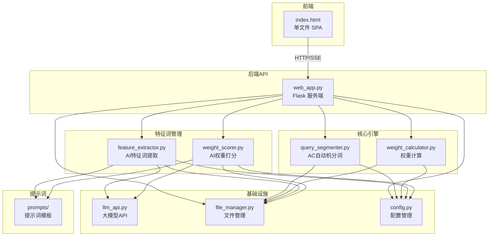

# 意图匹配分析平台 — 协同开发指南

> 本文档面向协同开发者，帮助快速了解系统架构、模块边界和接口约定，实现分模块并行开发。

## 系统架构总览



## 模块划分与负责人

| 模块 | 关键文件 | 职责 | 可独立开发 |
|------|---------|------|-----------|
| A. Web前端 | `scripts/templates/index.html` | 用户界面、交互逻辑 | ✅ |
| B. Web后端API | `scripts/web_app.py` | 路由、任务调度、SSE推送 | ⚠️ 需与前端/引擎协调 |
| C. 匹配引擎 | `scripts/modules/query_segmenter.py`<br/>`scripts/modules/weight_calculator.py` | AC自动机分词、权重计算 | ✅ |
| D. 特征词管理 | `scripts/modules/feature_extractor.py`<br/>`scripts/modules/weight_scorer.py` | AI特征词提取、权重打分 | ✅ |
| E. 基础设施 | `scripts/common/` | LLM API、文件管理、配置 | ✅ |
| F. 提示词 | `prompts/` | 各环节的AI提示词模板 | ✅ |
| G. 工作流脚本 | `scripts/workflows/` | 命令行批处理工作流 | ✅ |

## 各模块详细说明

---

### 模块A：Web前端

**文件**：`scripts/templates/index.html`（单文件SPA，含 CSS + JS）

**功能**：

- 分析Tab：上传Excel → 实时查看匹配进度 → 查看/下载结果
- 特征词管理Tab：上传意图清单 → AI提取特征词 → 预览/确认合并到词表
- 历史记录：查看和回溯历史分析

**关键JS函数**：

| 函数 | 作用 |
|------|------|
| `init()` | 页面初始化 |
| `loadDomains()` | 加载领域+权重词表 |
| `listenProgress(taskId)` | SSE监听任务进度 |
| `appendResultRow(r)` | 向结果表格追加一行 |
| `showDetail(idx)` | 打开详情弹窗 |
| `switchTab(tab)` | 切换Tab页 |
| `startFeatureExtract()` | 启动特征词提取 |
| `previewMerge()` | 预览合并结果 |
| `confirmMerge()` | 确认合并到词表 |

**开发约定**：

- 所有 API 调用使用 `fetch()`
- 进度推送使用 SSE（`EventSource`）
- DOM 元素 ID 命名：`kebab-case`

---

### 模块B：Web后端API

**文件**：`scripts/web_app.py`（Flask，端口5000）

**API 路由一览**：

| 路由 | 方法 | 用途 | 关联模块 |
|------|------|------|---------|
| `/` | GET | 返回前端页面 | A |
| `/api/domains` | GET | 获取领域列表及权重词表 | E |
| `/api/start` | POST | 上传Excel并启动分析任务 | C |
| `/api/progress/<task_id>` | GET(SSE) | 实时推送任务进度 | - |
| `/api/download/<task_id>` | GET | 下载结果Excel | - |
| `/api/upload-weights` | POST | 上传权重词表（multipart） | E |
| `/api/upload-weights-json` | POST | 上传权重词表（JSON body） | E |
| `/api/history` | GET | 列出历史分析结果 | E |
| `/api/history-detail` | GET | 读取指定历史结果 | E |
| `/api/intent-weights` | POST | 获取意图的特征词及权重 | E |
| `/api/feature-extract` | POST | 启动AI特征词提取 | D |
| `/api/feature-extract/progress/<id>` | GET(SSE) | 特征词提取进度 | D |
| `/api/feature-extract/merge` | POST | 预览+确认合并到词表 | D |
| `/api/weight-score` | POST | 对特征词AI打分 | D |
| `/api/weight-score/validate` | POST | 反向校验 | D |

**核心后台任务**：`run_intent_match_task()`

```
用户上传 Excel → 读取原始问 → 三维度AI转写
→ 四路并行AC匹配（原始问 + 三维度各自独立）
→ 权重计算（归一化 + IDF衰减 + 多源加分）
→ 阈值过滤 + AI筛选 → 诊断分析 → SSE推送
```

---

### 模块C：匹配引擎

**文件**：

- `scripts/modules/query_segmenter.py` — AC自动机分词器
- `scripts/modules/weight_calculator.py` — 权重计算器

**公开接口**：

```python
# query_segmenter.py
class QuerySegmenter:
    def load_and_build(self, weights_path: Path)
    def segment(self, query: str, domain: str) -> List[dict]
    # 返回: [{"词": str, "意图": str, "层级": str}]

# weight_calculator.py  
class WeightCalculator:
    def calculate(self, matched_words: List[dict], domain: str) -> List[dict]
    # 返回: [{"意图": str, "得分": float, "命中词数": int}]
    def calculate_with_config(self, matched_words, threshold, top_k, domain) -> List[dict]
```

**核心公式**：

| 编号 | 公式 | 说明 |
|------|------|------|
| F1 | `单词得分 = 层级权重 × 词权重` | 层级：核心词=1.0, 发散词=0.8, 同义词=0.6 |
| F2 | `原始得分 = Σ 单词得分` | 对命中词求和 |
| F3 | `归一化得分 = 原始得分 / 最大可能得分` | 跨意图可比 |
| F4 | `IDF(word) = 1/log₂(关联意图数+1)` | 共享词降权 |

---

### 模块D：特征词管理

**文件**：

- `scripts/modules/feature_extractor.py` — AI特征词提取
- `scripts/modules/weight_scorer.py` — AI权重打分

**公开接口**：

```python
# feature_extractor.py
class FeatureExtractor:
    def extract_from_intents(self, intents: List[str],
                             progress_callback=None,
                             intent_descriptions: dict = None) -> dict
    # 返回: {"意图映射表": {意图名: {核心词: [...], 发散词: [...], 同义词: [...]}}}
    
    def extract_from_match_results(self, results: List[dict],
                                   progress_callback=None) -> dict
    def merge_into_weights(self, new_features: dict, weights_path: str) -> dict
    # 返回: {"changelog": str, "stats": dict, "merged_data": dict}

# weight_scorer.py
class WeightScorer:
    def score_features(self, intent_map: dict,
                       all_intents: List[str] = None,
                       progress_callback=None) -> dict
    # 返回: {"词权重表": {"词": {"意图": {"权重": float, "理由": str}}}}
    
    def apply_idf_decay(self, weights_data: dict) -> dict
    def reverse_validate(self, weights_data: dict,
                         benchmark_data: List[dict]) -> List
```

---

### 模块E：基础设施

**文件**：`scripts/common/` 目录

| 文件 | 作用 | 公开接口 |
|------|------|---------|
| `llm_api.py` | 大模型API调用 | `call_llm_api(system, user) -> str`<br/>`call_llm_api_json(system, user) -> dict` |
| `file_manager.py` | 文件路径管理、JSON/Excel读写 | `FileManager` 类 |
| `config.py` | 配置管理（层级权重、阈值等） | `ConfigManager` 类 |
| `changelog_manager.py` | 变更日志管理 | `ChangeLogManager` 类 |
| `logger.py` | 日志工具 | — |

**当前LLM配置**：

- 模型：`Qwen/Qwen2.5-32B-Instruct`
- API：SiliconFlow OpenAI 兼容接口
- 调用间隔：5秒

---

### 模块F：提示词管理

**目录**：`prompts/`

| 文件 | 用途 |
|------|------|
| `feature_extract_prompt.md` | 特征词提取（六步规范） |
| `weight_score_prompt.md` | 权重打分（4维打分卡） |
| `wordlist_prompt.md` | 词表生成（提取+打分合并） |
| `query_rewrite_3d_prompt.md` | 三维度转写 |
| `intent_select_prompt.md` | AI意图筛选 |
| `topic_analysis_prompt.md` | 主题分析 |
| `intent_generation_prompt.md` | 意图生成 |

**修改提示词的注意事项**：

- 提示词中的JSON输出格式是AI输出的模板，修改后需同步修改对应Python解析代码
- `feature_extract_prompt.md` ↔ `feature_extractor.py/_build_extract_prompt()` + `_convert_new_format()`
- `weight_score_prompt.md` ↔ `weight_scorer.py/_build_score_prompt()`

---

### 模块G：工作流脚本

**目录**：`scripts/workflows/`

| 脚本 | 用途 | 命令示例 |
|------|------|---------|
| `run_wordlist.py` | 词表生成（提取+打分） | `py scripts/workflows/run_wordlist.py -d 失业保险 -i input.xlsx --auto` |
| `run_feature_extract.py` | 特征词提取 | `py scripts/workflows/run_feature_extract.py -d 失业保险 -i input.xlsx` |
| `run_weight_score.py` | 权重打分 | `py scripts/workflows/run_weight_score.py ...` |
| `run_benchmark_compare.py` | 标杆对比 | `py scripts/workflows/run_benchmark_compare.py ...` |
| `run_qwen_rewrite.py` | 千问转写 | `py scripts/workflows/run_qwen_rewrite.py ...` |

---

## 权重词表数据格式

所有模块共享的核心数据结构（`weighted_words.json`）：

```json
{
  "意图映射表": {
    "失业保险金申领": {
      "核心词": ["失业保险金"],
      "发散词": ["失业金", "申领", "领取"],
      "同义词": ["审核", "资格"]
    }
  },
  "词权重表": {
    "失业保险金": {
      "失业保险金申领": { "权重": 0.98, "理由": "核心专业术语" }
    }
  }
}
```

**兼容说明**：

- 新格式：一意图一词一分（`词权重表[词][意图] = {权重, 理由}`）
- 旧格式：全局权重（`词权重表[词] = {权重, 理由}`）
- 读取时自动兼容：判断 `词权重表[word]` 是否含 `"权重"` 键

## 本地开发环境

### 依赖安装

```powershell
pip install -r requirements.txt
```

核心依赖：`flask`, `pandas`, `openpyxl`, `openai`

### 启动开发服务器

```powershell
py scripts/web_app.py
# 访问 http://localhost:5000
```

### 目录约定

```
entity/
├── scripts/          # 全部Python代码
│   ├── web_app.py    # Web服务入口
│   ├── modules/      # 核心模块（A-D模块的Python代码）
│   ├── common/       # 基础设施
│   ├── workflows/    # 命令行工作流
│   └── templates/    # 前端页面
├── prompts/          # 提示词模板
├── config/           # 配置文件
├── result/           # 运行结果（Git忽略）
├── uploads/          # 上传文件暂存（Git忽略）
└── originalfile/     # 原始输入数据
```

## 开发协作规范

### 文件修改约定

| 修改类型 | 需要关注的模块 |
|----------|--------------|
| 修改前端UI | 仅改 `index.html`，确保调用的API路由存在 |
| 修改/新增API | 改 `web_app.py`，通知前端开发者新路由 |
| 修改匹配算法 | 改 C模块，确保返回格式不变 |
| 修改特征词提取逻辑 | 改 D模块，确保返回格式不变 |
| 修改提示词 | 改 `prompts/` 文件，同步更新对应Python解析代码 |

### 接口兼容原则

1. **不随意改变函数返回值结构**：修改模块内部逻辑时，保持对外接口的返回格式不变
2. **新增字段可以，删除字段要协调**：在 dict 中新增 key 是安全的，删除 key 需通知依赖方
3. **权重词表格式向后兼容**：读取时兼容旧格式（全局权重）和新格式（一意图一词一分）

### 提交规范

```
feat(模块名): 功能描述
fix(模块名): 修复描述
docs: 文档更新
refactor(模块名): 重构描述
```

示例：

```
feat(feature_extractor): 新增政务服务领域六步提取规范
fix(web_app): 合并时同步生成Excel格式
docs: 更新协同开发指南
```
