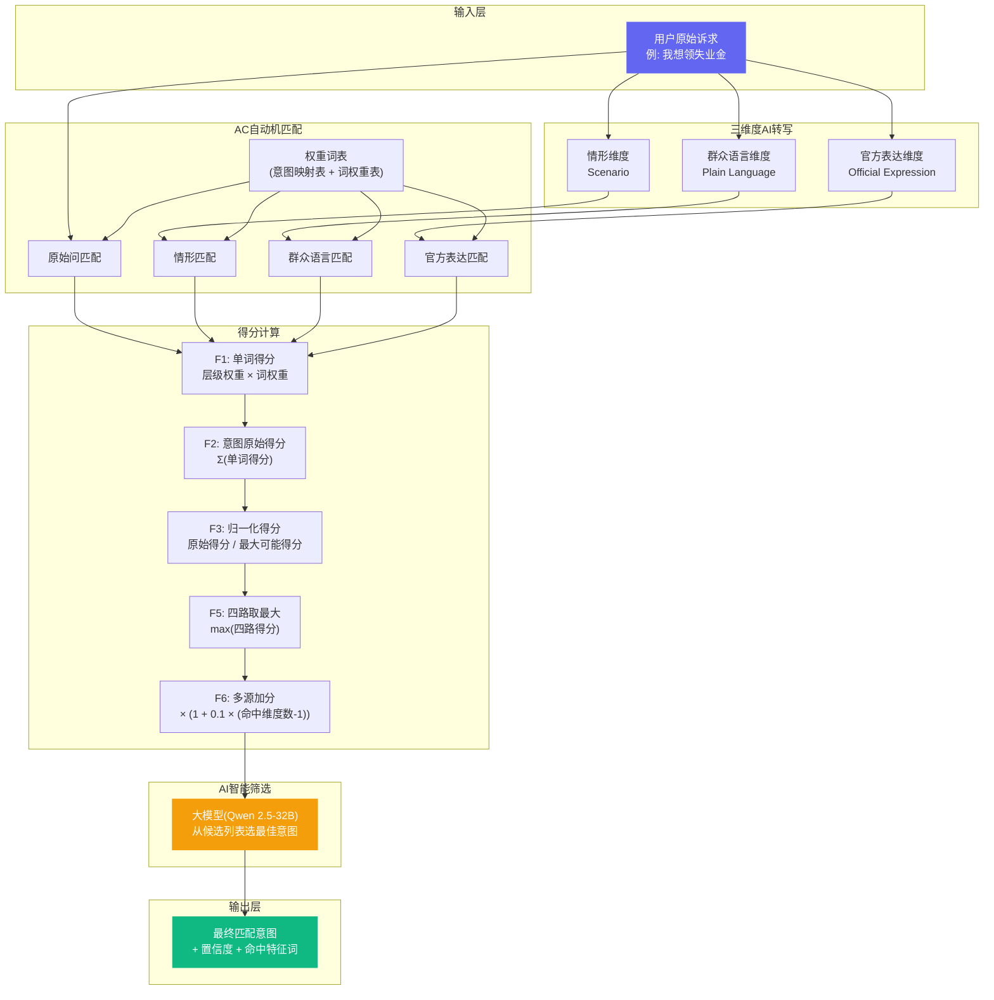
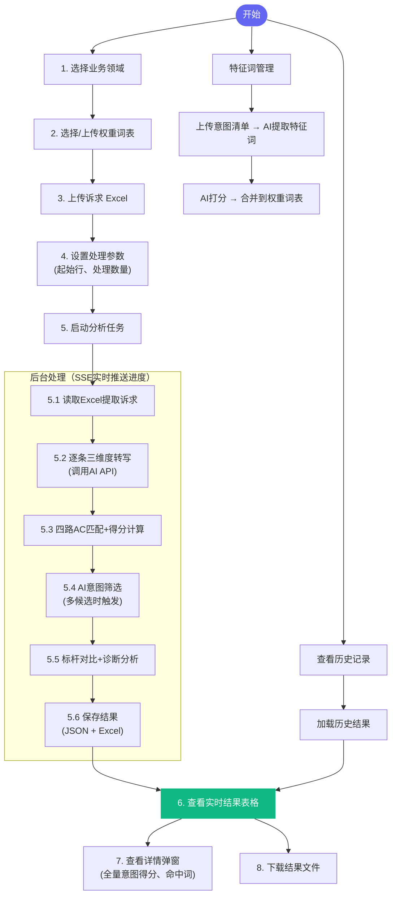
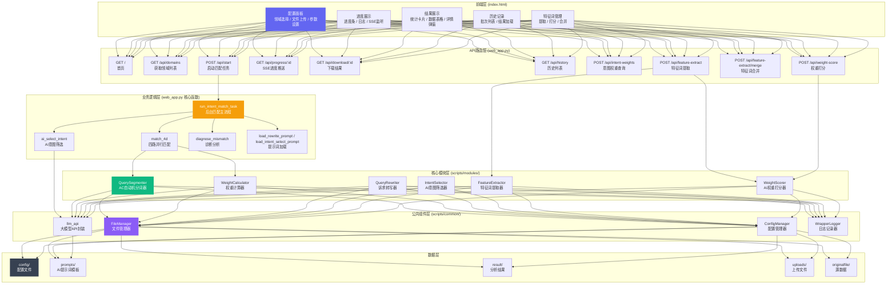
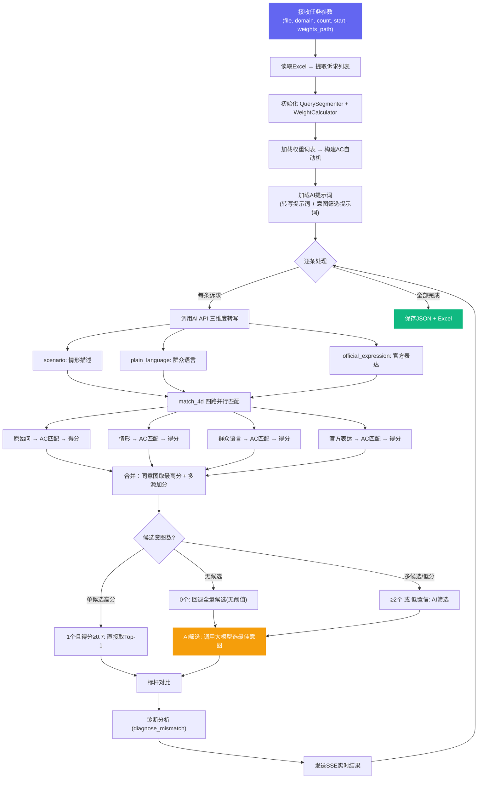
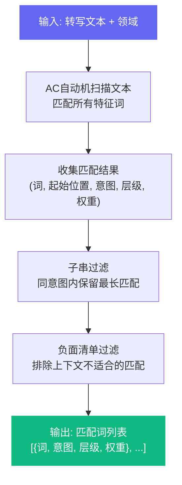
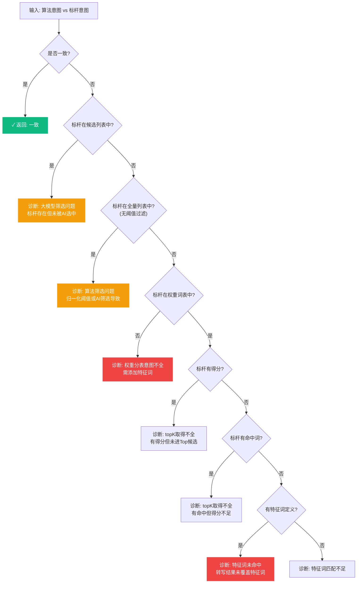
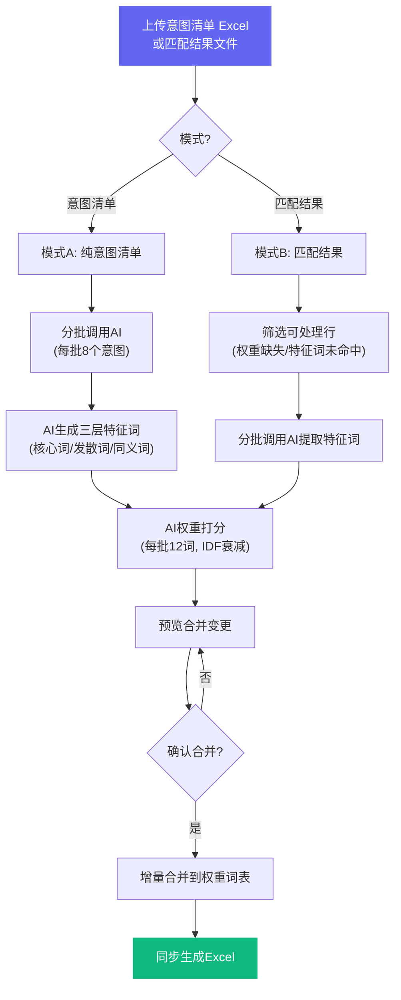

# 意图匹配分析平台 — 设计详细说明书

> **版本**: v1.0  
> **日期**: 2026-03-01  
> **适用范围**: 本文档面向项目开发团队，详细描述平台的功能原理、业务流程、模块划分、接口规范及核心算法，帮助新成员快速理解系统架构并参与协作开发。

---

## 目录

1. [系统概述](#1-系统概述)
2. [功能原理图](#2-功能原理图)
3. [业务流程图](#3-业务流程图)
4. [功能模块图](#4-功能模块图)
5. [功能流程图](#5-功能流程图)
6. [核心模块详解](#6-核心模块详解)
7. [API 接口说明](#7-api-接口说明)
8. [数据结构说明](#8-数据结构说明)
9. [配置文件说明](#9-配置文件说明)
10. [核心公式汇总](#10-核心公式汇总)
11. [开发指南](#11-开发指南)

---

## 1. 系统概述

### 1.1 平台定位

意图匹配分析平台是一个面向政务服务领域的**用户诉求意图识别系统**。平台通过「三维度转写 + AC自动机匹配 + AI智能筛选」的混合策略，将用户的口语化诉求精确映射到标准化的业务意图上。

### 1.2 核心目标

| 目标 | 说明 |
|------|------|
| **意图识别** | 将群众口语化诉求（如"我想领失业金"）映射到标准业务意图（如"失业保险金申领"） |
| **准确率验证** | 与标杆意图进行对比，量化评估匹配准确率 |
| **诊断分析** | 对不匹配的案例自动进行根因诊断，提供优化建议 |
| **特征词管理** | 支持 AI 自动提取特征词、打分及合并到权重词表 |

### 1.3 技术栈

```
前端: HTML + CSS + JavaScript（单页应用，暗色主题）
后端: Flask（Python 3.8+）
AI 引擎: Qwen 2.5-32B via SiliconFlow API（OpenAI 兼容接口）
匹配算法: pyahocorasick（Aho-Corasick 自动机）
数据处理: pandas / openpyxl
实时通信: Server-Sent Events (SSE)
```

### 1.4 项目目录结构

```
entity/
├── config/                     # 配置文件
│   ├── domains.json            #   领域定义
│   ├── layer_weights.json      #   三层权重配置
│   └── threshold.json          #   阈值与Top-K配置
├── prompts/                    # AI 提示词模板
│   ├── query_rewrite_3d_prompt.md    # 三维度转写提示词
│   ├── intent_select_prompt.md       # 意图筛选提示词
│   ├── feature_extract_prompt.md     # 特征词提取提示词
│   └── weight_score_prompt.md        # 权重打分提示词
├── scripts/
│   ├── web_app.py              # ★ Flask 主入口（后端+路由+业务逻辑）
│   ├── batch_intent_match.py   # 批量意图匹配（CLI版）
│   ├── modules/                # ★ 核心算法模块
│   │   ├── query_segmenter.py  #   AC自动机分词器
│   │   ├── weight_calculator.py#   权重计算器
│   │   ├── query_rewriter.py   #   诉求转写器
│   │   ├── intent_selector.py  #   AI意图筛选器
│   │   ├── feature_extractor.py#   特征词提取器
│   │   └── weight_scorer.py    #   AI权重打分器
│   ├── common/                 # 公共组件
│   │   ├── config.py           #   配置管理器
│   │   ├── file_manager.py     #   文件管理器
│   │   ├── llm_api.py          #   大模型API调用封装
│   │   └── logger.py           #   日志记录器
│   └── templates/
│       └── index.html          # ★ 前端页面（单文件SPA）
├── originalfile/               # 源数据（标杆Excel等）
├── result/                     # 分析结果输出
├── uploads/                    # 用户上传的临时文件
├── requirements.txt            # Python 依赖
└── .gitignore
```

---

## 2. 功能原理图

本图展示平台的核心算法原理——如何将一条用户诉求转化为匹配意图。



### 原理总结

| 步骤 | 技术 | 说明 |
|------|------|------|
| 1. 转写 | AI (Qwen 2.5) | 将口语诉求拆解为情形/群众语言/官方表达三个维度表述 |
| 2. 匹配 | AC自动机 | 在权重词表中做多模式字符串匹配，时间复杂度 O(n+m) |
| 3. 得分 | 公式计算 | 三层权重（L1=1.0, L2=0.8, L3=0.6）× 词权重，加归一化 |
| 4. 融合 | 四路取优 | 原始问 + 三维度各自匹配后取最优得分，多源命中额外加分 |
| 5. 筛选 | AI (Qwen 2.5) | 当多候选时调用大模型综合语义判断选出最佳意图 |

---

## 3. 业务流程图

本图展示用户使用平台的完整操作流程。



### 业务操作说明

| 步骤 | 操作 | 说明 |
|------|------|------|
| 选择领域 | 下拉框 | 系统自动扫描 `result/` 目录获取已有领域列表 |
| 权重词表 | 自动/手动 | 可使用领域默认词表或上传自定义 JSON |
| 上传诉求 | 拖拽/选择 | Excel 文件，需包含「原始问」列和可选「意图」列 |
| 启动分析 | 按钮 | 创建后台线程异步执行，通过 SSE 推送进度 |
| 结果展示 | 实时表格 | 每处理完一条即刷新显示 |
| 历史记录 | 折叠面板 | 可查看所有历史分析批次及准确率 |
| 特征词管理 | Tab切换 | 独立的特征词提取、打分和合并功能 |

---

## 4. 功能模块图

本图展示系统的分层架构和模块间调用关系。



### 模块依赖关系表

| 模块 | 依赖 | 被依赖 |
|------|------|--------|
| `web_app.py` | 所有 modules 和 common | 前端 index.html |
| `QuerySegmenter` | FileManager, ConfigManager, pyahocorasick | web_app, batch_intent_match |
| `WeightCalculator` | FileManager, ConfigManager | web_app, batch_intent_match |
| `FeatureExtractor` | FileManager, llm_api | web_app (特征词提取API) |
| `WeightScorer` | FileManager, llm_api | web_app (打分API), FeatureExtractor |
| `llm_api` | openai SDK | 所有AI相关模块 |
| `FileManager` | — | 几乎所有模块 |
| `ConfigManager` | FileManager | QuerySegmenter, WeightCalculator |

---

## 5. 功能流程图

### 5.1 意图匹配主流程



### 5.2 AC自动机匹配流程



### 5.3 诊断分析流程



### 5.4 特征词管理流程



---

## 6. 核心模块详解

### 6.1 QuerySegmenter（AC自动机分词器）

**文件**: `scripts/modules/query_segmenter.py`  
**职责**: 使用 Aho-Corasick 算法进行高效多模式字符串匹配

| 方法 | 说明 |
|------|------|
| `build_automaton(weighted_words)` | 从权重词表构建AC自动机 |
| `load_and_build(path)` | 加载JSON文件并构建自动机 |
| `segment(text, domain)` | 对文本执行匹配，返回命中词列表 |
| `_filter_substrings(matches)` | 同意图内保留最长匹配 |
| `_apply_negative_filter(query, matched)` | 负面清单过滤 |

**输入**: 权重词表JSON + 待匹配文本  
**输出**: `[{词, 意图, 层级, 权重}, ...]`

**关键细节**:

- AC自动机一次扫描完成所有模式词匹配，时间复杂度 O(n + m)
- 子串过滤只在同一意图内生效，不同意图的子串词均保留
- 支持负面清单：上下文中出现特定词时排除匹配

---

### 6.2 WeightCalculator（权重计算器）

**文件**: `scripts/modules/weight_calculator.py`  
**职责**: 根据AC匹配结果计算意图得分

| 方法 | 说明 |
|------|------|
| `calculate(matched_words, domain, intent_map)` | 计算得分（含归一化） |
| `calculate_with_config(matched_words, ...)` | 使用自定义阈值和Top-K计算 |

**核心公式**:

```
F1: 单词得分 = 层级权重(L) × 词权重(W)
F2: 意图原始得分 = Σ(单词得分)
F3: 归一化得分 = 原始得分 / 最大可能得分
```

**配置参数**:

- 层级权重: `L1=1.0, L2=0.8, L3=0.6`
- 最低阈值: `0.4`
- 最大返回数: `10`

---

### 6.3 FeatureExtractor（特征词提取器）

**文件**: `scripts/modules/feature_extractor.py`  
**职责**: AI自动生成意图的三层特征词

**两种模式**:

| 模式 | 输入 | 场景 |
|------|------|------|
| A. 纯意图清单 | 意图名称列表 | 新建词表 |
| B. 匹配结果 | 分析结果列表 | 补充词表 |

**三层特征词结构**:

- **L1_事项词**(核心词): 直接描述业务事项的关键词，权重最高
- **L2_动作词**(发散词): 与意图相关的动作和行为描述词
- **L3_场景词**(同义词): 场景化表述和同义替换词

---

### 6.4 WeightScorer（AI权重打分器）

**文件**: `scripts/modules/weight_scorer.py`  
**职责**: 对特征词进行 AI 权重打分，并应用 IDF 衰减

**核心流程**: 分批AI打分 → IDF衰减 → 反向校验

| 方法 | 说明 |
|------|------|
| `score_features(intent_map, all_intents)` | 分批AI打分 |
| `apply_idf_decay(weights_data)` | IDF衰减（跨意图共享词降权） |
| `reverse_validate(weights_data, benchmark)` | 用标杆数据反向校验 |

**IDF衰减公式**:

```
F4: IDF(word) = 1 / log₂(关联意图数 + 1)
有效权重 = AI基础权重 × IDF(word)
```

---

### 6.5 llm_api（大模型API封装）

**文件**: `scripts/common/llm_api.py`  
**职责**: 统一封装大模型API调用

| 函数 | 返回类型 | 说明 |
|------|----------|------|
| `call_llm_api(system_prompt, user_content)` | `str` | 返回原始文本 |
| `call_llm_api_json(system_prompt, user_content)` | `dict` | 自动提取并解析JSON |

**配置**:

- 模型: `Qwen/Qwen2.5-32B-Instruct`
- API: SiliconFlow OpenAI 兼容接口
- 重试: 失败后最多重试 2 次，间隔递增
- 限流: 每次调用间隔 5 秒

---

## 7. API 接口说明

### 7.1 核心接口

| 方法 | 路由 | 功能 | 请求格式 | 返回格式 |
|------|------|------|----------|----------|
| GET | `/` | 首页 | — | HTML |
| GET | `/api/domains` | 获取领域列表 | — | `[{name, has_weights, weights_files}]` |
| POST | `/api/start` | 启动匹配任务 | Form(file, domain, count, start, weights_path) | `{task_id}` |
| GET | `/api/progress/:id` | 实时进度 (SSE) | — | SSE 事件流 |
| GET | `/api/download/:id` | 下载结果 | — | Excel 文件 |
| GET | `/api/history` | 历史列表 | — | `[{domain, date, accuracy, ...}]` |
| GET | `/api/history-detail` | 历史详情 | Query(path) | `[{record}]` |

### 7.2 权重词表接口

| 方法 | 路由 | 功能 |
|------|------|------|
| POST | `/api/upload-weights` | 上传权重词表文件 |
| POST | `/api/upload-weights-json` | 通过JSON body上传权重词表 |
| POST | `/api/intent-weights` | 查询意图特征词及权重 |

### 7.3 特征词管理接口

| 方法 | 路由 | 功能 |
|------|------|------|
| POST | `/api/feature-extract` | 启动AI特征词提取 |
| GET | `/api/feature-extract/progress/:id` | 提取进度 (SSE) |
| POST | `/api/feature-extract/merge` | 合并特征词到词表 |
| POST | `/api/weight-score` | AI权重打分 |
| POST | `/api/weight-score/validate` | 反向校验 |

### 7.4 SSE 事件说明

启动任务后，通过 `/api/progress/:id` 接收以下事件：

| 事件类型 | 数据字段 | 说明 |
|----------|----------|------|
| `status` | `{phase, message}` | 阶段状态变更 |
| `progress` | `{phase, current, total, message}` | 进度更新 |
| `result` | `{序号, 原始问题, 算法意图, ...}` | 单条结果 |
| `done` | `{match_count, total_count, accuracy}` | 任务完成 |
| `error` | `{message, traceback}` | 任务出错 |
| `heartbeat` | `{}` | 心跳保活 |

---

## 8. 数据结构说明

### 8.1 权重词表 (weighted_words.json)

```json
{
    "意图映射表": {
        "失业保险金申领": {
            "L1_事项词": ["失业保险金", "失业金"],
            "L2_动作词": ["申领", "领取", "办理"],
            "L3_场景词": ["失业了", "没工作", "被裁员"]
        }
    },
    "词权重表": {
        "失业保险金": {
            "权重": 0.95,
            "层级": "L1_事项词",
            "理由": "核心业务术语"
        },
        "申领": {
            "权重": 0.8,
            "层级": "L2_动作词",
            "理由": "常见业务动作"
        }
    }
}
```

### 8.2 分析结果记录

每条分析结果包含以下字段：

| 字段 | 类型 | 说明 |
|------|------|------|
| `序号` | int | 从1开始编号 |
| `原始问题` | str | 截取前80字符 |
| `转写结果` | str | 三维度转写展示文本 |
| `转写来源` | str | `AI四路并行` / `原始` |
| `算法意图` | str | 最终匹配的意图名称 |
| `全量意图` | str | 所有候选意图（顿号分隔） |
| `意图特征词` | str | 命中的特征词标注 |
| `全量特征词定位` | str | 所有意图的命中词及得分 |
| `标杆意图` | str | Excel中的参考意图 |
| `是否一致` | str | `✓` 或 `✗` |
| `分析结果` | str | 诊断分析文本 |
| `详情` | dict | 完整详情（全量得分、命中词等） |

### 8.3 诊断分析结构

```json
{
    "诊断类别": "大模型筛选问题",
    "诊断详情": "标杆意图「...」存在于候选列表但未被AI选中",
    "转写覆盖度": 0.65,
    "竞争意图": "失业保险关系转移",
    "竞争得分差": 0.15,
    "修复建议": ["优化意图筛选 prompt", "检查意图名称相似度"]
}
```

**诊断类别枚举**:

| 类别 | 含义 | 修复方向 |
|------|------|----------|
| 一致 | 匹配正确 | — |
| 大模型筛选问题 | 标杆在候选中但AI选错 | 优化AI筛选prompt |
| 算法筛选问题 | 标杆在全量中但被归一化过滤 | 调低阈值 |
| 权重分表意图不全 | 标杆意图未在词表中 | 添加特征词 |
| topK取得不全 | 标杆有得分但未入候选 | 增大top_k |
| 特征词未命中 | 转写未覆盖特征词 | 补充同义词 |
| 特征词匹配不足 | 词表有词但未命中 | 检查覆盖度 |

---

## 9. 配置文件说明

### 9.1 config/layer_weights.json

三层权重配置，控制不同层级特征词的重要性。

```json
{
    "L1": 1.0,
    "L2": 0.8,
    "L3": 0.6
}
```

- **L1（事项词/核心词）**: 权重最高，直接定义业务事项
- **L2（动作词/发散词）**: 中等权重，描述业务动作
- **L3（场景词/同义词）**: 最低权重，覆盖口语化表达

### 9.2 config/threshold.json

匹配阈值和候选数量配置。

```json
{
    "min_score": 0.4,
    "top_k": 5
}
```

- `min_score`: 归一化后最低得分阈值，低于此分的意图被过滤
- `top_k`: 返回的候选意图最大数量

### 9.3 config/domains.json

领域定义，支持多领域扩展。

```json
{
    "失业保险": {
        "name": "失业保险",
        "description": "失业保险相关业务",
        "keywords": ["失业", "失业金", "失业保险", "稳岗", "技能补贴"]
    }
}
```

---

## 10. 核心公式汇总

| 编号 | 名称 | 公式 | 所在模块 |
|------|------|------|----------|
| F1 | 单词得分 | `层级权重(L) × 词权重(W)` | WeightCalculator |
| F2 | 意图原始得分 | `Σ(所有命中词的单词得分)` | WeightCalculator |
| F3 | 归一化得分 | `原始得分 / (该意图最大可能得分)` | WeightCalculator |
| F4 | IDF衰减 | `IDF(word) = 1 / log₂(关联意图数 + 1)` | WeightScorer |
| F5 | 四路取优 | `意图最终得分 = max(原始问, 情形, 群众语言, 官方表达)` | web_app.match_4d |
| F6 | 多源加分 | `增强得分 = 基础得分 × (1 + 0.1 × (命中维度数 - 1))` | web_app.match_4d |
| F7 | 反向权重 | `反向权重 = (标杆应得分 - 已知贡献) / 层级权重` | WeightScorer |
| F8 | 转写覆盖度 | `覆盖度 = len(命中特征词 ∩ 全量特征词) / len(全量特征词)` | web_app.diagnose_mismatch |

---

## 11. 开发指南

### 11.1 环境搭建

```bash
# 1. 安装 Python 3.8+

# 2. 安装依赖
pip install -r requirements.txt

# 主要依赖：
# - flask          Web框架
# - pandas         数据处理
# - openpyxl       Excel读写
# - pyahocorasick  AC自动机
# - openai         大模型API客户端
```

### 11.2 启动服务

```bash
# 启动 Web 服务（开发模式）
py scripts/web_app.py

# 服务地址: http://localhost:5000
```

### 11.3 命令行批量匹配

```bash
# 使用CLI版本进行批量匹配
py scripts/batch_intent_match.py \
    -f originalfile/失业保险/标杆意图.xlsx \
    -w result/失业保险/weighted/weighted_words.json \
    -d 失业保险 \
    -c 50 \
    --auto-rewrite
```

### 11.4 模块开发注意事项

| 要点 | 说明 |
|------|------|
| **路径处理** | 使用 `pathlib.Path`，项目根目录通过 `Path(__file__).parent.parent` 获取 |
| **编码** | 统一 UTF-8，入口处自动修复 Windows 终端编码 |
| **AI调用间隔** | 必须遵守 `DEFAULT_INTERVAL = 5秒` 的调用间隔限制 |
| **错误处理** | 全局异常处理在 `web_app.py` 中通过 `@app.errorhandler` 统一捕获 |
| **日志** | 使用 `WrapperLogger` 记录每步处理日志，保存到 `result/{domain}/logs/` |
| **实时通信** | 后台任务通过 `Queue` + SSE 推送进度到前端 |
| **线程安全** | 后台任务在独立 `daemon` 线程中执行，通过 `tasks` dict 共享状态 |

### 11.5 新增领域扩展步骤

1. 在 `config/domains.json` 添加领域定义
2. 准备该领域的标杆意图 Excel 文件放入 `originalfile/{领域}/`
3. 通过平台的特征词管理功能生成权重词表
4. 运行匹配任务验证准确率
